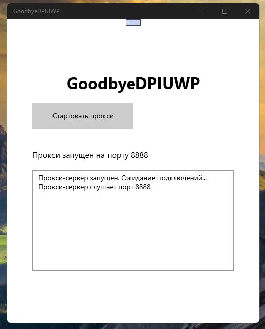

# GoodbyeDPIUWP

Этот репозиторий на данный момент лишь моя невозможная идея смастерить эдакий менеджер DPI для UWP с помощью какого-нить ИИ... Нахрапом решить проблему не удалось. Возможно, однажды я еще вернусь к сей теме.... уже с WinRT/UWP C++ и с вызовом из осн. приложения консольной утилитки-службы... не знаю.

## Скриншот

## Результаты от "WindSurf" на тему GoodbyeDPI UWP edition:

Как вручную настроить прокси для Wi-Fi на Windows 10 Mobile

Откройте настройки Wi-Fi:

Перейдите в меню Параметры → Сеть и беспроводная связь → Wi-Fi.

Выберите свою Wi-Fi сеть:

Найдите подключённую сеть Wi-Fi и нажмите на неё.

Откройте дополнительные параметры:

Пролистайте вниз и найдите раздел Прокси.

Включите ручную настройку прокси:

В разделе Прокси выберите Вручную.

Заполните поля:

Адрес прокси-сервера:

Введите 127.0.0.1 (или IP-адрес устройства, если прокси работает на другом устройстве).

Порт:

Введите 8888 (или другой порт, который использует ваше приложение-прокси).

Сохраните изменения:

Нажмите Готово или Сохранить.

Проверьте подключение:

Откройте браузер или приложение, чтобы убедиться, что трафик идёт через ваш локальный прокси.

Как вернуть настройки обратно после завершения работы приложения

Повторите шаги 1–4 выше.

В разделе Прокси выберите Нет или Отключить.

Сохраните изменения.

Важно!

После завершения работы приложения-прокси обязательно отключите прокси в настройках Wi-Fi, иначе интернет может перестать работать.

Для HTTPS-сайтов (например, m.youtube.com) потребуется установить доверенный сертификат, если прокси использует MITM (об этом будет отдельная 
инструкция).

Если потребуется — я могу подготовить аналогичную инструкцию для Windows 10/11 Desktop или других платформ.

Готов приступить к созданию YouTubeAppUWP с WebView и встроенным прокси! :)

## Тех. труда
- Результат труда в папке Src. Ничего не заработало

## Ссылки
- https://github.com/ValdikSS/GoodbyeDPI/ Сорцы консольного варики GoodbyeDPI для настольной Винды 10/11

## ..
Как есть. Что называется, "сделай если сможешь"

## .
[M][E] 9 июля 2025 

